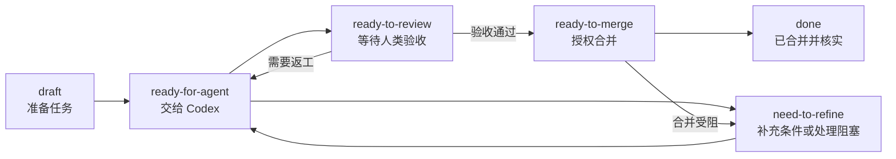

<div align="center">

# lark-handoff

**在飞书交接任务，让 Codex 完成开发，由人类验收交付。**

连接飞书任务、本地 Git 项目与 Pull Request 的 Codex 工作流。
从任务接管到代码合并，进展、验证结果和交付记录始终回到同一条任务。

[快速开始](#快速开始) · [工作流程](#工作流程) · [配置说明](#配置说明) · [文档](#文档)

</div>

---

## 项目介绍

把任务交给 Agent，不应意味着在聊天窗口、代码仓库和任务看板之间反复搬运上下文。

lark-handoff 以飞书任务清单作为交接入口：你写明目标与验收标准，Codex 根据任务的「所属项目」找到本地仓库，在独立工作树中开发、验证并交付 PR。你验收具体提交后，Codex 按仓库规则完成合并，将结果回写原任务。

本仓库提供 Codex 技能、状态契约与执行规范。工作流由 Codex 执行，支持手动触发或通过 Codex Scheduled 定时运行，不提供独立常驻服务。

## 核心能力

- **从任务到 PR**：读取任务与评论，在任务分支上实现、自测、推送，并创建或更新 PR。
- **明确的人类验收**：开发成果先进入待验收状态；合并前核对人类批准的具体提交、CI 和仓库规则。
- **按项目隔离执行**：通过「所属项目」映射本地仓库，每项任务使用独立 Git worktree，保留用户现有工作区。
- **多任务协作**：主 Agent 负责调度，sub-agent 执行单个任务；独立开发任务可并行，同一远端仓库的合并串行处理。
- **可追溯、可恢复**：开始、交付、阻塞和合并结果写入任务评论，本地 journal 保存执行证据，供中断后核验与恢复。

## 工作流程



| 状态 | 含义 | 下一步 |
| --- | --- | --- |
| `draft` | 任务尚在准备 | 人类补齐目标、范围与验收标准 |
| `ready-for-agent` | 已授权 Agent 开发 | Codex 实现、验证并交付 PR |
| `ready-to-review` | PR 已交付，等待验收 | 人类验收通过后设为 `ready-to-merge`；返工时设为 `ready-for-agent` |
| `need-to-refine` | 条件不足、验证有缺口或执行受阻 | 人类补充信息后重新交接；也可验收已有具体提交后授权合并 |
| `ready-to-merge` | 已验收具体提交，授权合并 | Codex 核对 PR 与远端结果，完成后设为 `done` |
| `done` | PR 已合并，成果已在 `origin/main` 核实 | 流程结束 |

启用执行模式后，`ready-for-agent` 和 `ready-to-merge` 是自动工作的触发状态。Agent 只主动设置 `ready-to-review`、`need-to-refine` 和 `done`。

这些状态属于飞书任务的自定义单选字段，与基础任务的完成状态不同。`done` 表示代码合并完成，不代表部署完成。完整规则见[状态契约](.agents/skills/lark-handoff/references/contract.md)。

## 快速开始

### 1. 准备运行环境

- 可访问本仓库及目标本地 Git 项目的 Codex 环境。
- 已安装并授权的 `lark-cli`，以及 `lark-task`、`lark-shared` 技能；CLI 缺少读取评论的封装时，还需 `lark-openapi-explorer`。
- 目标仓库的 Git 提交身份、既有远端访问权限，以及已认证的 PR 管理工具，可创建、读取、更新和合并 PR，并读取 CI 与评审结果。
- 飞书清单中已配置六个精确状态名称及「所属项目」字段，具备任务、字段和评论所需的读写权限。详见[飞书接口说明](.agents/skills/lark-handoff/references/lark.md)。

### 2. 配置清单与本地项目

用 Codex 打开本仓库，核对 [handoff.json](handoff.json) 中的清单与状态字段，再创建本机配置：

```bash
cp handoff.local.example.json handoff.local.json
```

将示例路径替换为真实项目的绝对路径：

```json
{
  "project_roots": ["/absolute/path/to/projects"],
  "projects": {
    "example-project": "/absolute/path/to/example-project"
  }
}
```

`projects` 的键必须与飞书任务「所属项目」解析出的名称一致。没有精确映射时，工作流会在 `project_roots` 的直接子目录中按项目名称查找。

### 3. 执行只读预检

在 Codex 中发送：

```text
使用 $lark-handoff 对当前 handoff 配置做只读预检，列出可执行任务、项目映射、缺失的权限和状态选项；不写入评论、状态或代码。
```

如果当前会话尚未发现技能，可让 Codex 直接读取 `.agents/skills/lark-handoff/SKILL.md`。核对预检结果中的目标仓库与 remote，补齐缺失配置后再执行。

### 4. 交接并执行一轮

在飞书任务中填写「所属项目」，补充交接内容，并将自定义状态设为 `ready-for-agent`。任务描述可使用以下模板：

```text
目标：用户在什么场景下，应该看到什么行为。
范围：需要改动的功能、页面或 skill；必要时附文件或上下文链接。
验收：可观察的完成条件，以及必须通过的检查。
备注：其他约束或前置依赖。
```

在 Codex 中发送：

```text
使用 $lark-handoff 执行一轮 handoff 扫描，按契约处理 ready-for-agent 和 ready-to-merge，并将每项执行结果评论到原任务。
```

交付进入 `ready-to-review` 后，打开 PR，按照任务评论中的步骤验收**所记录的提交**。通过后设为 `ready-to-merge`，下一轮执行会完成合并并核实结果；需要返工时，补充评论并设为 `ready-for-agent`。

## 配置说明

| 文件 | 用途 |
| --- | --- |
| [handoff.json](handoff.json) | 清单 GUID、自定义状态字段 GUID 和六个精确状态名称 |
| [handoff.local.example.json](handoff.local.example.json) | 本机项目路径配置模板 |
| `handoff.local.json` | 本机项目名称与绝对路径映射，已被 Git 忽略 |

仓库中的 `handoff.json` 已绑定维护者的 `handoff` 清单。接入自己的清单时，请替换 `tasklist_guid` 与 `status_field_guid`，并核对状态选项名称。状态选项 GUID 在运行时从接口解析，不保存在配置中；登录凭据由 `lark-cli` 管理。

项目定位仅以任务的「所属项目」字段为依据。字段缺失、映射不唯一或仓库不匹配时，工作流记录阻塞，不猜测目标项目。

## 定时运行

完成只读预检后，可在 Codex Scheduled 中选择本仓库作为入口，按所需频率执行同一技能。默认只在一台主机上配置一个定时入口；没有候选任务、恢复事项或新问题时保持安静。

启动检查、可复制的调度提示词及旧版状态迁移说明见 [Scheduled 运行说明](docs/scheduled.md)。创建技能文件不会自动启用调度。

## 文档

| 文档 | 内容 |
| --- | --- |
| [技能入口](.agents/skills/lark-handoff/SKILL.md) | 手动与定时运行的统一入口 |
| [状态契约](.agents/skills/lark-handoff/references/contract.md) | 状态定义、授权边界、项目映射与分支约定 |
| [多 Agent 调度](.agents/skills/lark-handoff/references/dispatch.md) | 任务分配、并发边界与执行者收尾 |
| [执行流程](.agents/skills/lark-handoff/references/execution.md) | 开发、PR 交付、验收后合并与异常处理 |
| [飞书接口](.agents/skills/lark-handoff/references/lark.md) | 任务读取、自定义状态、评论与权限 |
| [审计与恢复](.agents/skills/lark-handoff/references/audit.md) | 评论格式、运行锁、journal 与恢复规则 |
| [定时运行](docs/scheduled.md) | Scheduled 配置与人类验收说明 |
